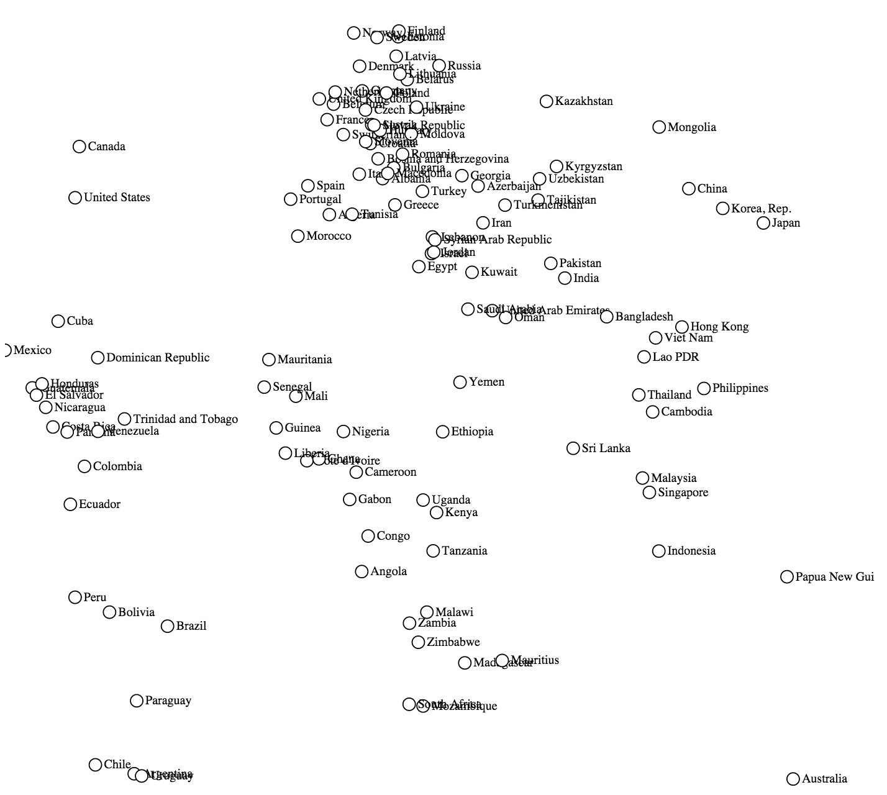
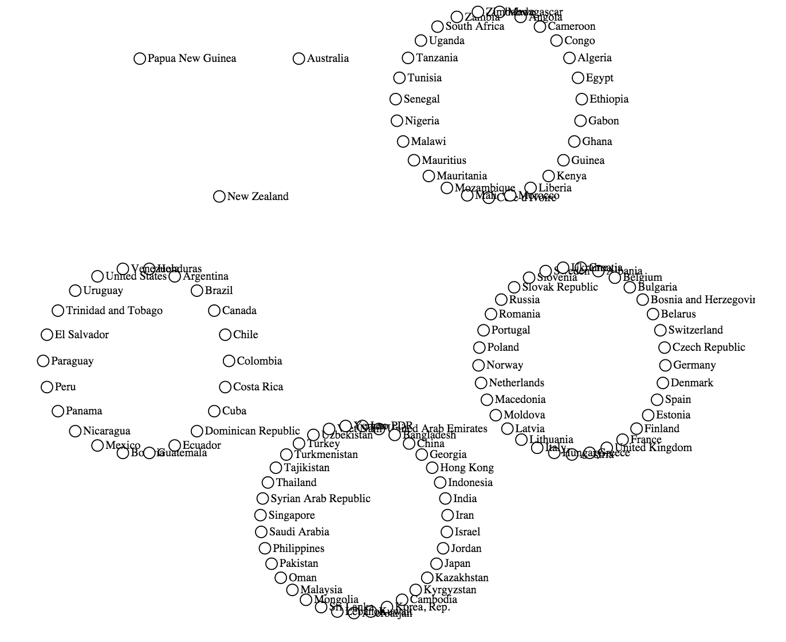
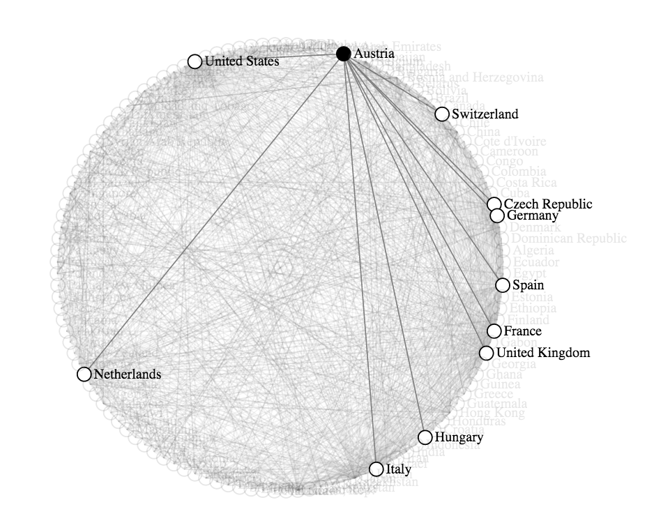

Project 2
===

In this project, I will keep creating interactive visualizations using D3. I will focus on [scatterplots](http://en.wikipedia.org/wiki/Scatter_plot) and [graphs](http://en.wikipedia.org/wiki/Graph_drawing), using the [same dataset](data/countries_2012.json) of 119 countries from the previous project. Below are screenshots of some examples of visualizations we expect I to implement. Here, nodes are countries and links are trade flows between countries.

  
  
  

In contrast to project 1, which focused on implementation, in this project we will primarily focus on designing visualizations. This project is divided into two parts. First, I will learn to:

1. Create and use a [graph data structure](http://en.wikipedia.org/wiki/Graph_%28abstract_data_type%29), which is used very frequently in visualization.
2. Use different D3 layouts to display the graph's nodes.
3. Connect nodes and group them to prevent overlaps and improve readability.

The second part of this project is design studio implementation. I design and implement a visualization that effectively communicates the trade flows between countries from the dataset.